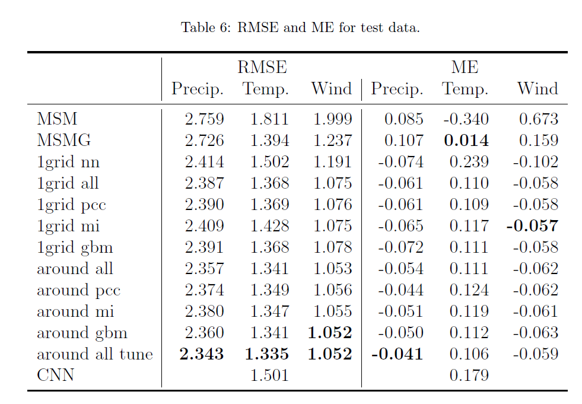

# PostMSM — Machine-learning post-processing for JMA MSM (and MSMG)

Authors: Kazuma Iwase, Tomoyuki Takenawa  
Affiliation: Tokyo University of Marine Science and Technology (TUMSAT)

[](https://colab.research.google.com/github/ttakenawa/PostMSM/blob/main/gbm_main_public.ipynb)

---

## Overview
This repository provides a public demo notebook for our paper on machine-learning post-processing
of JMA MSM forecasts (precipitation, temperature, wind speed) and comparisons with MSM Guidance (MSMG).

### Note on released code and data
Due to data licensing restrictions, some distributed datasets are **NOT** the original (real) MSM/MSMG data
and are provided as **synthetic/derived substitutes**. Therefore, running this notebook with the shared data
may **not exactly reproduce** the paper results.

## Results

The following table summarizes **RMSE** and **ME (mean error)** on the **test dataset (year 2023)** for baseline forecasts
(MSM, MSMG) and our post-processing models (1grid/around feature settings with different feature-selection options).


---

## Data

### Public synthetic dataset (Google Drive)
A public synthetic/derived dataset for running the demo is available via Google Drive.
The shared Drive link is provided inside the notebook (`gbm_main_public.ipynb`).

This shared folder contains:
- Synthetic MSM/MSMG-like inputs regenerated by a stochastic method (NOT the original MSM/MSMG data)
- Real observation CSVs (JMA station observations)

### Real data for full reproducibility (licensed / external)
To fully reproduce the paper results, you must obtain the original data separately (under the appropriate permissions)
and prepare it in the same file/column format expected by this notebook.

**Where to obtain the real data (as cited/described in the paper):**
- **MSM (JMA Mesoscale Model) data**: distributed via Research Institute for Sustainable Humanosphere (RISH), Kyoto University  
  http://database.rish.kyoto-u.ac.jp/index-e.html
- **MSMG (MSM Guidance)**: provided by JMA and distributed by Japan Meteorological Business Support Center (JMBSC)
- **Station observations (teacher data)**: JMA observations including 3-hour accumulated precipitation, hourly temperature, and wind speed

---

## Dataset / task summary (paper settings)
Targets:
- 3-hour accumulated precipitation
- hourly temperature
- wind speed

Period split:
- Train: 2019–2021
- Validation: 2022
- Test: 2023

Input configurations:
- Nearest-grid configuration: 62 features
- Surrounding-grid configuration: 5,702 features

Missing values:
- MSM fields have no missing values; only observation samples with missing values are excluded.

---

## Demo notebook
- `gbm_main_public.ipynb` — main Colab demo notebook  
  https://colab.research.google.com/github/ttakenawa/PostMSM/blob/main/gbm_main_public.ipynb

### How to run on Google Colaboratory
Please follow the instructions in the notebook for:
- obtaining the public synthetic dataset (Drive link),
- adding the shared folder as a Drive shortcut (optional),
- mounting Google Drive in Colab and setting `ROOT`.

A typical `ROOT` example is:

```python
from pathlib import Path
ROOT = Path("/content/drive/MyDrive/PostMSM/data_public")
```

### Memory / Colab note
This notebook can be RAM-heavy depending on the number of stations and lead times you load.

- For reproducible runs, we recommend a high-memory runtime (≈40 GB RAM or more).
- On Google Colab, selecting an **A100 (High-RAM)** runtime is a convenient option.
  (You may not actually need GPU acceleration, but the A100 runtime also provides the large-RAM environment.)

---

## License / Terms
- **Code**: (choose a license, e.g. MIT / Apache-2.0)
- **Data**: The shared dataset includes synthetic/derived substitutes plus real station observations.  
  Original MSM/MSMG data are not redistributed in this repository due to licensing restrictions.

---

## Citation
Citation information will be added after submission/publication (and/or arXiv posting).

---

## Contact
- For questions or issues, please open a GitHub Issue in this repository or mail to takenawa@kaiyodai.ac.jp
