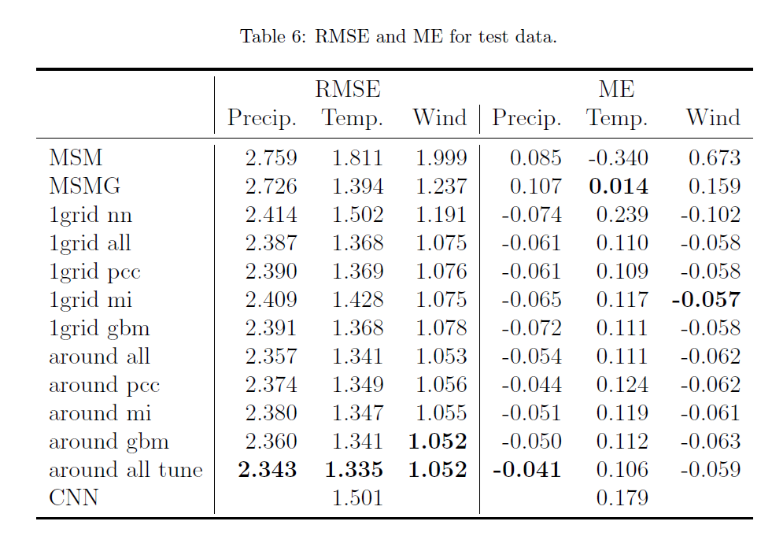

# PostMSM — Machine-learning post-processing for JMA MSM (and MSMG)

Authors: Kazuma Iwase, Tomoyuki Takenawa  
Affiliation: Tokyo University of Marine Science and Technology (TUMSAT)

[](https://colab.research.google.com/github/ttakenawa/PostMSM/blob/main/gbm_main_public.ipynb)
[](https://colab.research.google.com/github/ttakenawa/PostMSM/blob/main/weighted_tweedie_precip_public.ipynb)

---

## Overview
This repository provides public demo notebooks for our study on machine-learning post-processing
of JMA MSM forecasts for precipitation, temperature, and wind speed, together with comparisons
against MSM and MSM Guidance (MSMG).

The repository currently includes:
- a **main non-Tweedie notebook** for the standard LightGBM-based post-processing workflow, and
- a **weighted Tweedie notebook** for precipitation-focused experiments designed to improve
  event-oriented performance for moderate to heavy rainfall.

### Note on released code and data
Due to data licensing restrictions, some distributed datasets are **NOT** the original (real) MSM/MSMG data
and are provided as **synthetic/derived substitutes**. Therefore, running these notebooks with the shared data
may **not exactly reproduce** the paper results.

---

## Notebooks

### 1. Main non-Tweedie notebook
Notebook: `gbm_main_public.ipynb`

This notebook demonstrates the standard LightGBM-based post-processing workflow used in our study.

Main targets:
- 3-hour accumulated precipitation
- hourly temperature
- wind speed

Main comparisons:
- MSM
- MSMG
- post-processed predictions using nearest-grid and surrounding-grid inputs

### 2. Weighted Tweedie notebook
Notebook: `weighted_tweedie_precip_public.ipynb`

This notebook demonstrates a precipitation-specific extension of the main workflow.

Purpose:
- improve event-oriented precipitation performance, especially for moderate and heavy rainfall

Main characteristics:
- precipitation only
- LightGBM with a **Tweedie objective**
- additional **sample weighting** for larger precipitation events
- comparison against the base LightGBM precipitation model and MSMG

This notebook is intended as a focused demonstration of the precipitation-oriented extension,
rather than a replacement for the full three-variable workflow.

---

## Results
The following table summarizes **RMSE** and **ME (mean error)** on the **test dataset (2023)** for the baseline forecasts
(MSM and MSMG) and our post-processing models.  
Models labeled **1grid-** and **around-** are our **LightGBM-based** approaches using nearest-grid and surrounding-grid inputs,
respectively, with different feature-selection settings.

<p align="center">
  
</p>

### Note on precipitation-focused Tweedie experiments
In addition to the standard regression setting, this repository also includes a precipitation-focused
weighted Tweedie formulation. This extension is intended to better emphasize rainfall events and to improve
event-based precipitation metrics such as TS and POD at higher thresholds. Depending on the setting,
this may improve event-oriented behavior while not always improving RMSE.

---

## Data

### Public synthetic dataset (Google Drive)
A public synthetic/derived dataset for running the demo is available via Google Drive.
The shared Drive link is provided inside the notebook.

This shared folder contains:
- synthetic MSM/MSMG-like inputs regenerated by a stochastic method (**NOT** the original MSM/MSMG data)
- real observation CSVs (JMA station observations)

### Real data for full reproducibility (licensed / external)
To fully reproduce the paper results, you must obtain the original data separately (under the appropriate permissions)
and prepare it in the same file/column format expected by these notebooks.

**Where to obtain the real data (as cited/described in the paper):**
- **MSM (JMA Mesoscale Model) data**: distributed via Research Institute for Sustainable Humanosphere (RISH), Kyoto University  
  http://database.rish.kyoto-u.ac.jp/index-e.html
- **MSMG (MSM Guidance)**: provided by JMA and distributed by Japan Meteorological Business Support Center (JMBSC)
- **Station observations (teacher data)**: JMA observations including 3-hour accumulated precipitation, hourly temperature, and wind speed

---

## Dataset / task summary (paper settings)

Targets:
- 3-hour accumulated precipitation
- hourly temperature
- wind speed

Period split:
- Train: 2019–2021
- Validation: 2022
- Test: 2023

Input configurations:
- nearest-grid configuration: 62 features
- surrounding-grid configuration: 5,702 features

Missing values:
- MSM fields have no missing values
- only samples with missing observation values are excluded

### Additional precipitation setting in the weighted Tweedie notebook
For the precipitation-only Tweedie experiments:
- the target is 3-hour accumulated precipitation
- the base model is a LightGBM precipitation model
- the Tweedie variant applies a Tweedie objective together with event weighting
- the shared public notebook uses synthetic/derived public inputs and a public output folder structure

---

## How to run on Google Colaboratory

Please follow the instructions in the notebooks for:
- obtaining the public synthetic dataset (Drive link)
- adding the shared folder as a Drive shortcut (optional)
- mounting Google Drive in Colab and setting `ROOT`

A typical `ROOT` example is:

```python
from pathlib import Path
ROOT = Path("/content/drive/MyDrive/PostMSM/data_public")
```

### Memory / Colab note
This notebook can be RAM-heavy depending on the number of stations and lead times you load.

- For reproducible runs, we recommend a high-memory runtime (≈40 GB RAM or more).
- On Google Colab, selecting an **A100 (High-RAM)** runtime is a convenient option.
  (You may not actually need GPU acceleration, but the A100 runtime also provides the large-RAM environment.)

---

## License / Terms
- **Code**: MIT License (see LICENSE)
- **Data**:
  - **Synthetic/derived inputs (created by us)**: MIT License
  - **Station observations (JMA)**: provided under JMA Terms of Use (Public Data License v1.0-based). Please follow the original terms and include proper attribution.
  - **Original MSM/MSMG**: not redistributed in this repository due to licensing restrictions.


---

## Citation
Citation information will be added after submission/publication (and/or arXiv posting).

---

## Contact
- For questions or issues, please open a GitHub Issue in this repository or mail to takenawa@kaiyodai.ac.jp
